# PDF to EXCEL
The project is about to build a system that read a pdf file, extract data from it and write it in excel file.
## Installation
1. Download [VS code](https://code.visualstudio.com/)
## Environment SetUp
We need some [Python](https://www.python.org/downloads/) libraries.
To work with Python in [VS code](https://code.visualstudio.com/), we should install the Python extension.

a. Click on the "Extensions" icon in the sidebar on the left (or use the keyboard shortcut Ctrl+Shift+X on Windows/Linux or Cmd+Shift+X on macOS).

b. In the search bar at the top of the Extensions pane, type "Python."

c. Find the "Python" extension by Microsoft and click the "Install" button.
1. Install [pypdf2](https://pypi.org/project/PyPDF2/) & [pdfplumber](https://pypi.org/project/pdfplumber/) for PDF extraction.
2. Install [openpyxl](https://openpyxl.readthedocs.io/en/stable/index.html) & [pandas](https://pandas.pydata.org/) for Excel manipulation.
3. Install [matplotlib](https://matplotlib.org/) for Visualization

You can install these features via pip, write the command in Teminal
```bash
pip install pypdf2
pip install pdfplumber
pip install openpyxl
pip install pandas
pip install matplotlib
```
To update these features, use the following command
```bash
pip install --upgrade pip
```
## Working With pypdf2
### Extract data from pdf file
The following code will read a page(0th) of simple text from a source file table with text.pdf(replace it with the name of your source file)
```bash
from PyPDF2 import PdfReader

reader = PdfReader("table with text.pdf")
page = reader.pages[0]
print(page.extract_text())
```
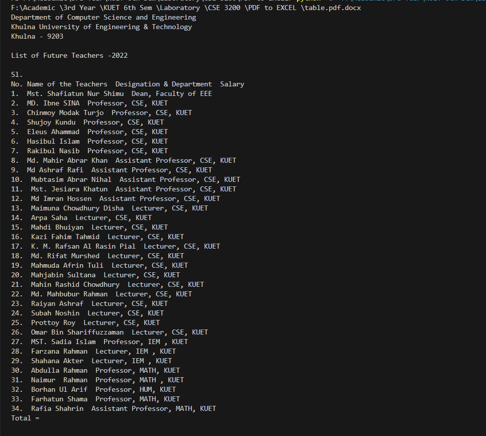

we can limit the text orientation by using the following code instead of "print(page.extract_text())"
```bash
# extract only text oriented up
print(page.extract_text(0))

# extract text oriented up and turned left
print(page.extract_text((0, 90)))
```

## Working With pdfplumber

```bash
import pdfplumber

with pdfplumber.open("text.pdf") as pdf:
    first_page = pdf.pages[0]
    print(first_page.chars[0])
```
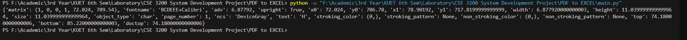

### Extract text from the PDF:

To extract all the text from the PDF, we can iterate through each page and extract the text as follows:

```bash
import pdfplumber

with pdfplumber.open("text.pdf") as pdf:
    text = ''
    for page in pdf.pages:
        text += page.extract_text()
        print(text)
```
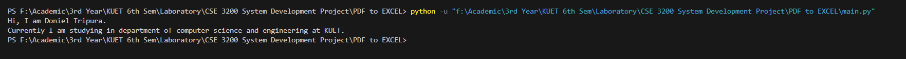
We can also extract text from a specific page by using pdf.pages[i], where i is the page number (0-based index).
```bash
import pdfplumber

with pdfplumber.open("text.pdf") as pdf:
    text=''
    text += pdf.pages[0].extract_text()
    print(text)
```
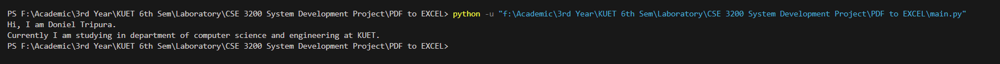

### Extract table data:

If the PDF contains tables, you can extract table data as well. pdfplumber allows you to extract tables from PDFs as Pandas DataFrames, making it easy to work with tabular data.

**Note:** If the pdf file contains table within text, the following code can simply ignore it extracting only the table data.
```bash
import pdfplumber
import pandas as pd

# Open the PDF file
with pdfplumber.open('table.pdf') as pdf:
    # Extract a table from a specific page
    page = pdf.pages[0]  # You can specify the page number
    table = page.extract_table()

# Convert the extracted table data to a Pandas DataFrame
df = pd.DataFrame(table)

# Print the DataFrame
print(df)
```
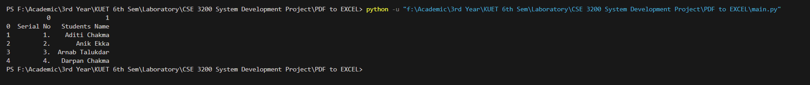

### Save the table as csv file
```bash
df.to_csv('table_data.csv', index=False)
```
#### csv file output
```bash
Serial No,Students Name
1.,Aditi Chakma
2.,Anik Ekka
3.,Arnab Talukdar
4.,Darpan Chakma
```
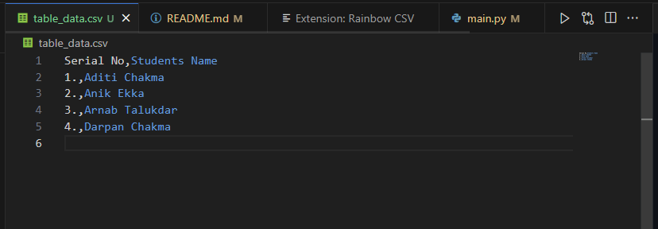
### Save the table as excel file
```bash
df.to_excel('table_data.xlsx', index=False)
```
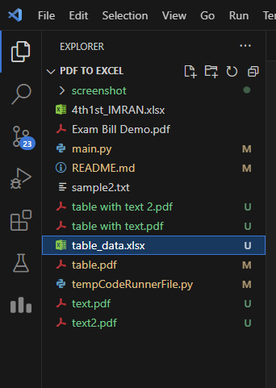
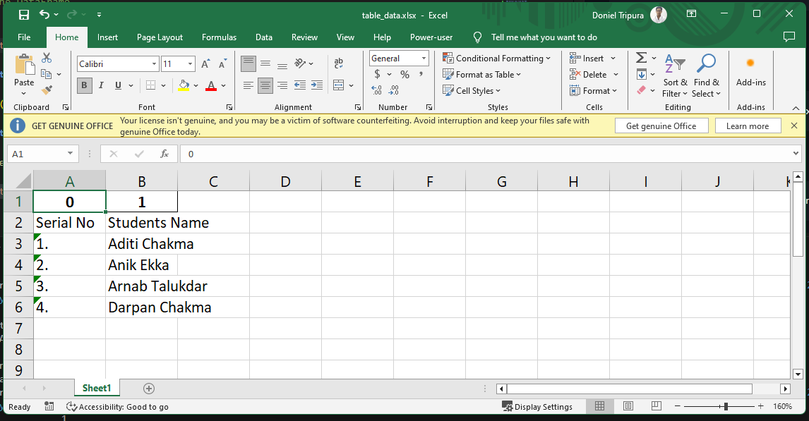
### Save the table as a 2D matrix 
If you want to save the table data from a PDF as a 2D matrix (i.e., a list of lists), you can do so by simply converting the extracted table into a 2D list

```bash
import pdfplumber

# Open the PDF file
with pdfplumber.open('table.pdf') as pdf:
    # Extract a table from a specific page
    page = pdf.pages[0]  # You can specify the page number
    table = page.extract_table()

# Convert the extracted table data into a 2D matrix (list of lists)
matrix = [list(row) for row in table]

# Print the matrix (for verification)
for row in matrix:
    print(row)
```

### Save the 2D matrix as csv file
```bash
import pdfplumber
import csv

# Open the PDF file
with pdfplumber.open('table.pdf') as pdf:
    # Extract a table from a specific page
    page = pdf.pages[0]  # You can specify the page number
    table = page.extract_table()

# Convert the extracted table data into a 2D matrix (list of lists)
matrix = [list(row) for row in table]

# Print the matrix (for verification)
for row in matrix:
    print(row)

with open('matrix_data.csv', 'w', newline='') as csvfile:
    csvwriter = csv.writer(csvfile)
    for row in matrix:
        csvwriter.writerow(row)

```
### Save the 2D matrix as excel file
```bash
import pdfplumber
import pandas as pd

# Open the PDF file
with pdfplumber.open('table.pdf') as pdf:
    # Extract a table from a specific page
    page = pdf.pages[0]  # You can specify the page number
    table = page.extract_table()

# Convert the extracted table data into a 2D matrix (list of lists)
matrix = [list(row) for row in table]

# Print the matrix (for verification)
for row in matrix:
    print(row)

df = pd.DataFrame(matrix)

# Save the DataFrame to an Excel file
df.to_excel('matrix_data.xlsx', index=False, header=False)
```
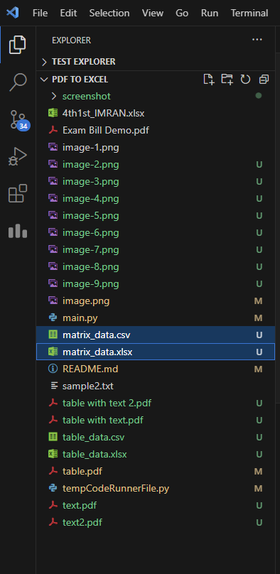
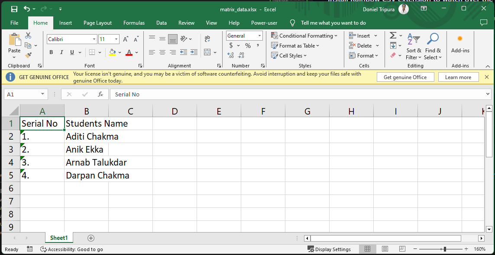
#### Install Rainbow CSV extension to watch over the csv file directly
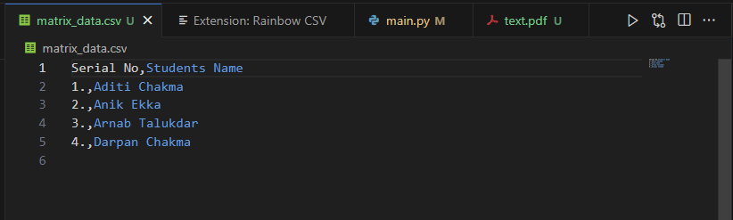

### Write extracting data from pdf to excel
Here, Initially I have a pdf file containing serial no and name of some students and an excel file containing only serial no, i want to enter the name into it.
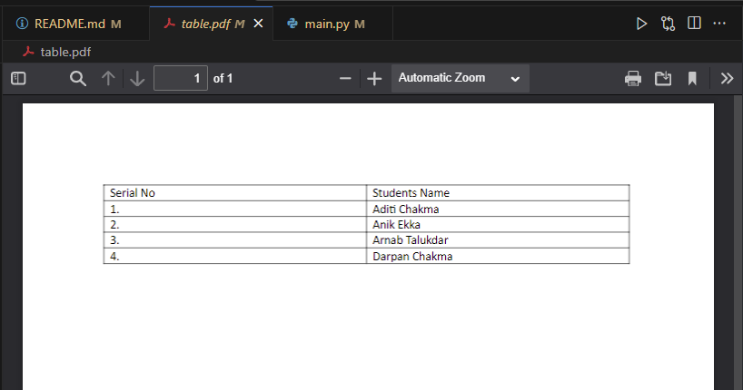
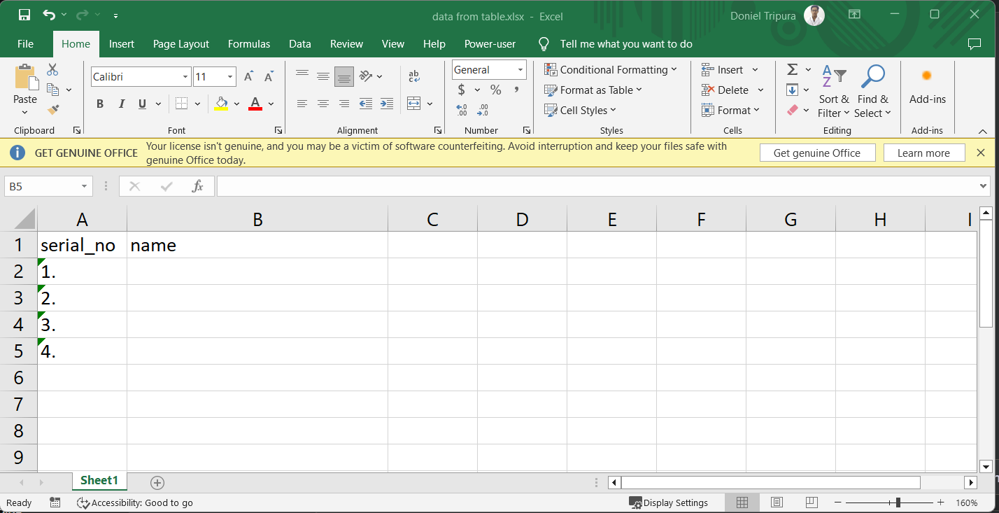

```bash
import pdfplumber
from openpyxl import load_workbook

# Open the PDF file
with pdfplumber.open('table.pdf') as pdf:
    # Extract data from the PDF
    data = {}
    for page in pdf.pages:
        for line in page.extract_text().split('\n'):
            row = line.split()  # Assuming the data is space-separated, adjust as needed
            if len(row) >= 2:
                serial_no = row[0]
                name = row[1]
                data[serial_no] = name

# Load the Excel file
excel_file = 'data from table.xlsx'
wb = load_workbook(excel_file)
sheet = wb.active  # Select the active sheet, you can choose a specific sheet if needed

# Iterate through the Excel file and insert names
for row in sheet.iter_rows(min_row=2, max_row=sheet.max_row, min_col=1, max_col=2):
    serial_no = row[0].value
    if serial_no in data:
        name = data[serial_no]
        row[1].value = name

# Save the modified Excel file
wb.save(excel_file)
```
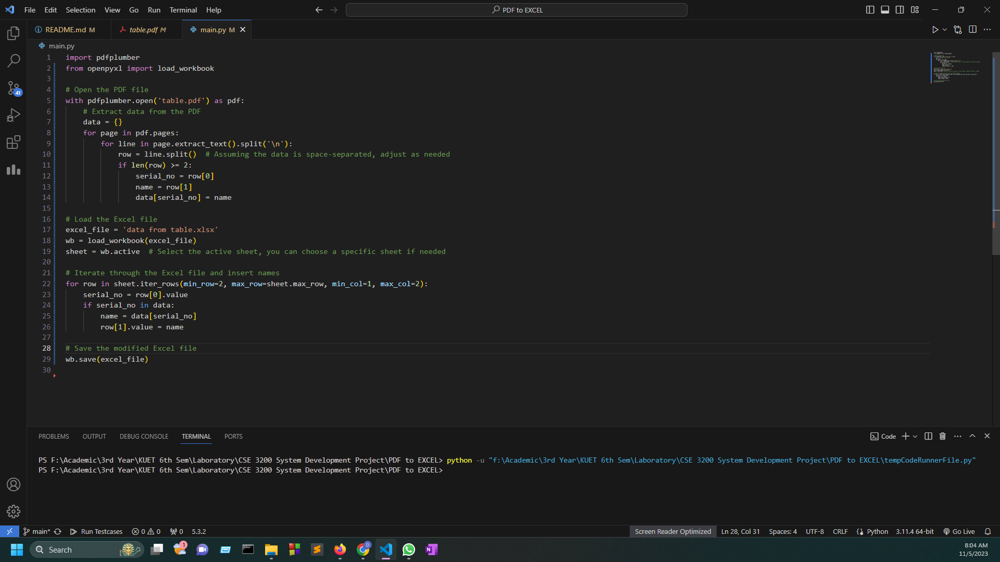
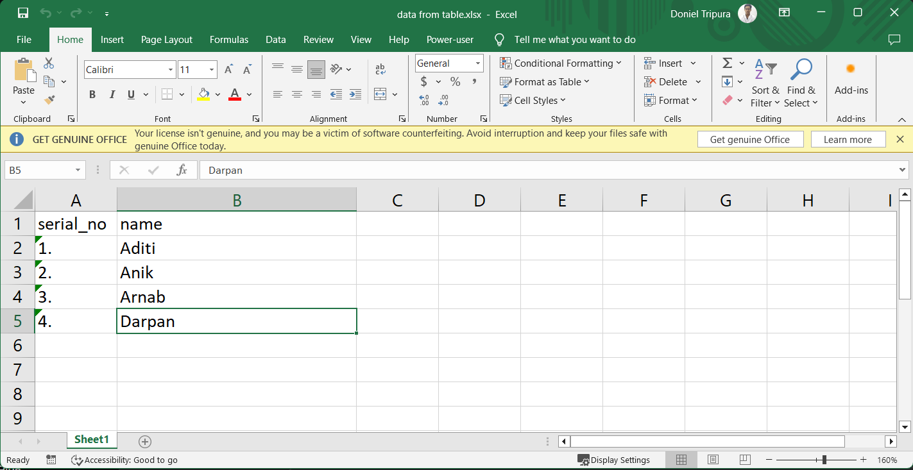
**Note:** Before running the program, the excel file needs to be closed.
When an Excel file is open in an application, it is often locked for editing by other processes, including external scripts. That's why we may experience the issue where our Python script can't save the Excel file when it is open in Excel.
or simply we can use xlwings library or pywin32 to autmate Excel from Python script. Those libraries help us to manipulate the Excel file including writing data, even when they are open in Excel.
```bash
pip install xlwings
```
```bash
import pdfplumber
import xlwings as xw

# Open the PDF file
with pdfplumber.open('table.pdf') as pdf:
    # Extract data from the PDF
    data = {}
    for page in pdf.pages:
        for line in page.extract_text().split('\n'):
            row = line.split()  # Assuming the data is space-separated, adjust as needed
            if len(row) >= 2:
                serial_no = row[0]
                name = row[1]
                data[serial_no] = name

# Open the Excel file using xlwings
excel_file = 'data from table.xlsx'
app = xw.App(visible=True)  # This will open Excel if it's not already running

try:
    wb = app.books.open(excel_file)
    sheet = wb.sheets.active  # Select the active sheet, or specify a specific sheet

    # Iterate through the Excel file and insert names into the first column (A)
    for row in sheet.range('A2:A{}'.format(sheet.cells.last_cell.row)):  # Use only the first column
        serial_no = row.value
        if serial_no in data:
            name = data[serial_no]
            row.offset(column_offset=1).value = name  # Offset by 1 column to insert the name

    # Save the modified Excel file
    wb.save()
finally:
    app.quit()

```


## Reference
Visit these sites for more info. 

https://pypdf2.readthedocs.io/en/3.0.0/

https://pypi.org/project/pdfplumber/

https://openpyxl.readthedocs.io/en/stable/index.html

https://pandas.pydata.org/

https://matplotlib.org/