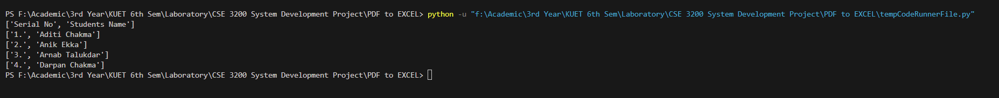

# PDF to EXCEL
The project is about to build a system that read a pdf file, extract data from it and write it in excel file.
## Installation
1. Download [VS code](https://code.visualstudio.com/)
## Environment SetUp
We need some [Python](https://www.python.org/downloads/) libraries.
To work with Python in [VS code](https://code.visualstudio.com/), we should install the Python extension.

a. Click on the "Extensions" icon in the sidebar on the left (or use the keyboard shortcut Ctrl+Shift+X on Windows/Linux or Cmd+Shift+X on macOS).

b. In the search bar at the top of the Extensions pane, type "Python."

c. Find the "Python" extension by Microsoft and click the "Install" button.
1. Install [pypdf2](https://pypi.org/project/PyPDF2/) & [pdfplumber](https://pypi.org/project/pdfplumber/) for PDF extraction.
2. Install [openpyxl](https://openpyxl.readthedocs.io/en/stable/index.html) & [pandas](https://pandas.pydata.org/) for Excel manipulation.
3. Install [matplotlib](https://matplotlib.org/) for Visualization

You can install these features via pip, write the command in Teminal
```bash
pip install pypdf2
pip install pdfplumber
pip install openpyxl
pip install pandas
pip install matplotlib
```
To update these features, use the following command
```bash
pip install --upgrade pip
```
## Working With pypdf2
### Extract data from pdf file
The following code will read a page(0th) of simple text from a source file table with text.pdf(replace it with the name of your source file)
```bash
from PyPDF2 import PdfReader

reader = PdfReader("table with text.pdf")
page = reader.pages[0]
print(page.extract_text())
```


we can limit the text orientation by using the following code instead of "print(page.extract_text())"
```bash
# extract only text oriented up
print(page.extract_text(0))

# extract text oriented up and turned left
print(page.extract_text((0, 90)))
```

## Working With pdfplumber

```bash
import pdfplumber

with pdfplumber.open("text.pdf") as pdf:
    first_page = pdf.pages[0]
    print(first_page.chars[0])
```


### Extract text from the PDF:

To extract all the text from the PDF, we can iterate through each page and extract the text as follows:

```bash
import pdfplumber

with pdfplumber.open("text.pdf") as pdf:
    text = ''
    for page in pdf.pages:
        text += page.extract_text()
        print(text)
```

We can also extract text from a specific page by using pdf.pages[i], where i is the page number (0-based index).
```bash
import pdfplumber

with pdfplumber.open("text.pdf") as pdf:
    text=''
    text += pdf.pages[0].extract_text()
    print(text)
```


### Extract table data:

If the PDF contains tables, you can extract table data as well. pdfplumber allows you to extract tables from PDFs as Pandas DataFrames, making it easy to work with tabular data.

**Note:** If the pdf file contains table within text, the following code can simply ignore it extracting only the table data.
```bash
import pdfplumber
import pandas as pd

# Open the PDF file
with pdfplumber.open('table.pdf') as pdf:
    # Extract a table from a specific page
    page = pdf.pages[0]  # You can specify the page number
    table = page.extract_table()

# Convert the extracted table data to a Pandas DataFrame
df = pd.DataFrame(table)

# Print the DataFrame
print(df)
```


### Save the table as csv file
```bash
df.to_csv('table_data.csv', index=False)
```
#### csv file output
```bash
Serial No,Students Name
1.,Aditi Chakma
2.,Anik Ekka
3.,Arnab Talukdar
4.,Darpan Chakma
```

### Save the table as excel file
```bash
df.to_excel('table_data.xlsx', index=False)
```


### Save the table as a 2D matrix 
If you want to save the table data from a PDF as a 2D matrix (i.e., a list of lists), you can do so by simply converting the extracted table into a 2D list

```bash
import pdfplumber

# Open the PDF file
with pdfplumber.open('table.pdf') as pdf:
    # Extract a table from a specific page
    page = pdf.pages[0]  # You can specify the page number
    table = page.extract_table()

# Convert the extracted table data into a 2D matrix (list of lists)
matrix = [list(row) for row in table]

# Print the matrix (for verification)
for row in matrix:
    print(row)
```

### Save the 2D matrix as csv file
```bash
import pdfplumber
import csv

# Open the PDF file
with pdfplumber.open('table.pdf') as pdf:
    # Extract a table from a specific page
    page = pdf.pages[0]  # You can specify the page number
    table = page.extract_table()

# Convert the extracted table data into a 2D matrix (list of lists)
matrix = [list(row) for row in table]

# Print the matrix (for verification)
for row in matrix:
    print(row)

with open('matrix_data.csv', 'w', newline='') as csvfile:
    csvwriter = csv.writer(csvfile)
    for row in matrix:
        csvwriter.writerow(row)

```
### Save the 2D matrix as excel file
```bash
import pdfplumber
import pandas as pd

# Open the PDF file
with pdfplumber.open('table.pdf') as pdf:
    # Extract a table from a specific page
    page = pdf.pages[0]  # You can specify the page number
    table = page.extract_table()

# Convert the extracted table data into a 2D matrix (list of lists)
matrix = [list(row) for row in table]

# Print the matrix (for verification)
for row in matrix:
    print(row)

df = pd.DataFrame(matrix)

# Save the DataFrame to an Excel file
df.to_excel('matrix_data.xlsx', index=False, header=False)
```


#### Install Rainbow CSV extension to watch over the csv file directly


### Write extracting data from pdf to excel
Here, Initially I have a pdf file containing serial no and name of some students and an excel file containing only serial no, i want to enter the name into it.


```bash
import pdfplumber
from openpyxl import load_workbook

# Open the PDF file
with pdfplumber.open('table.pdf') as pdf:
    # Extract data from the PDF
    data = {}
    for page in pdf.pages:
        for line in page.extract_text().split('\n'):
            row = line.split()  # Assuming the data is space-separated, adjust as needed
            if len(row) >= 2:
                serial_no = row[0]
                name = row[1]
                data[serial_no] = name

# Load the Excel file
excel_file = 'data from table.xlsx'
wb = load_workbook(excel_file)
sheet = wb.active  # Select the active sheet, you can choose a specific sheet if needed

# Iterate through the Excel file and insert names
for row in sheet.iter_rows(min_row=2, max_row=sheet.max_row, min_col=1, max_col=2):
    serial_no = row[0].value
    if serial_no in data:
        name = data[serial_no]
        row[1].value = name

# Save the modified Excel file
wb.save(excel_file)
```


**Note:** Before running the program, the excel file needs to be closed.
When an Excel file is open in an application, it is often locked for editing by other processes, including external scripts. That's why we may experience the issue where our Python script can't save the Excel file when it is open in Excel.
or simply we can use xlwings library or pywin32 to autmate Excel from Python script. Those libraries help us to manipulate the Excel file including writing data, even when they are open in Excel.
```bash
pip install xlwings
```
```bash
import pdfplumber
import xlwings as xw

# Open the PDF file
with pdfplumber.open('table.pdf') as pdf:
    # Extract data from the PDF
    data = {}
    for page in pdf.pages:
        for line in page.extract_text().split('\n'):
            row = line.split()  # Assuming the data is space-separated, adjust as needed
            if len(row) >= 2:
                serial_no = row[0]
                name = row[1]
                data[serial_no] = name

# Open the Excel file using xlwings
excel_file = 'data from table.xlsx'
app = xw.App(visible=True)  # This will open Excel if it's not already running

try:
    wb = app.books.open(excel_file)
    sheet = wb.sheets.active  # Select the active sheet, or specify a specific sheet

    # Iterate through the Excel file and insert names into the first column (A)
    for row in sheet.range('A2:A{}'.format(sheet.cells.last_cell.row)):  # Use only the first column
        serial_no = row.value
        if serial_no in data:
            name = data[serial_no]
            row.offset(column_offset=1).value = name  # Offset by 1 column to insert the name

    # Save the modified Excel file
    wb.save()
finally:
    app.quit()

```
## Lets Jump into the Project
```bash
import pdfplumber

# Open the PDF file
with pdfplumber.open('Exam Bill Demo.pdf') as pdf:
    table = None

    # Iterate through all pages
    for page in pdf.pages:
        # Attempt to extract a table from the page
        extracted_table = page.extract_table()

        # Check if a table was successfully extracted
        if extracted_table:
            table = extracted_table
            break  # Exit the loop if a table is found on any page

    if table:
        # Iterate over the rows and columns of the table
        for row in table:
            for cell in row:
            # cell=row[2]
                print(cell, end='\t')  # Printing the cell value, separate columns with tabs
            print()  # Start a new line for the next row
```
## Lets print all the tables from pdf file
```bash
import pdfplumber

# Open the PDF file
with pdfplumber.open('Exam Bill Demo.pdf') as pdf:
    tables = []  # Initialize a list to store tables

    # Iterate through all pages
    for page in pdf.pages:
        # Attempt to extract a table from the page
        extracted_table = page.extract_table()

        # Check if a table was successfully extracted
        if extracted_table:
            tables.append(extracted_table)  # Append the table to the list

    # Process the accumulated tables (if any)
    for table in tables:
        # Iterate over the rows and columns of each table
        for row in table:
            for cell in row:
                print(cell, end='\t')  # Printing the cell value, separate columns with tabs
            print()  # Start a new line for the next row
        print()
    print()
```
we need to identify each table seperately, and accoding to its title, we need to extract data.
```bash
import pdfplumber

# Open the PDF file
with pdfplumber.open('Exam Bill Demo.pdf') as pdf:
    tables = []  # Initialize a list to store tables

    # Iterate through all pages
    for page in pdf.pages:
        # Attempt to extract a table from the page
        extracted_table = page.extract_table()

        # Check if a table was successfully extracted
        if extracted_table:
            tables.append(extracted_table)  # Append the table to the list

    # Process the accumulated tables (if any)
    table_no=0
    for table in tables:
        # Iterate over the rows and columns of each table
        table_no+=1
        print("Table no: "+str(table_no))
        for row in table:
            for cell in row:
                print(cell, end='\t')  # Printing the cell value, separate columns with tabs
            print()  # Start a new line for the next row
        print()
    print()
```

## latest
```bash
import pdfplumber

# Open the PDF file
with pdfplumber.open('Exam Bill Demo.pdf') as pdf:
    preceding_line = None  # Initialize variable to store the preceding line
    table_no = 0  # Initialize the table number

    # Iterate through all pages
    for page in pdf.pages:
        # Extract text content from the page
        page_text = page.extract_text()
        
        # Check if the page contains a table
        if page.extract_table():
            # Increment the table number
            table_no += 1
            # Store the text immediately preceding the table
            preceding_line = page_text

        # If we have a stored preceding line, process it and the table
        if preceding_line:
            print()
            print()
            print("Table no:", table_no)
            print()
            print()
            print("Preceding Line:", preceding_line)
            print()
            print()
            print()
            print("Table Start:")
            print()
            print()
            table = page.extract_table()
            if table:
                for row in table:
                    for cell in row:
                        print(cell, end='\t')
                    print()
            print()
            preceding_line = None
```

# Environment to make Specific PDF to Many excel files
```bash
import tkinter as tk
from tkinter import filedialog, messagebox, ttk
import pdfplumber
import pandas as pd
import os

def extract_data_from_pdf(pdf_file):
    with pdfplumber.open(pdf_file) as pdf:
        text_content = ""
        tables_with_titles = []
        for page in pdf.pages:
            text_content += page.extract_text()
            tables = page.extract_tables()
            if tables:
                for table in tables:
                    # Extracting the title before the table
                    table_start = table[0][1] if table else 0
                    text_before_table = page.extract_text()
                    lines = text_before_table.split('\n')
                    title = ""
                    for line in reversed(lines):
                        if line.strip():
                            title = line
                            break
                    tables_with_titles.append({"Title": title, "Table": table})
    return text_content, tables_with_titles


def select_pdf():
    global pdf_file
    pdf_file = filedialog.askopenfilename()
    if pdf_file:
        pdf_label.config(text=f"Selected PDF: {pdf_file}")
        pdf_label.pack()


def generate_excel():
    global pdf_file
    if pdf_file:
        text_content, tables_with_titles = extract_data_from_pdf(pdf_file)
        
        output_dir = filedialog.askdirectory()
        print(output_dir)  # Debug line to check the selected directory
        
        if output_dir:
            if not os.path.exists(output_dir):
                os.makedirs(output_dir)  # Create the directory if it doesn't exist
            if tables_with_titles:
                for idx, data in enumerate(tables_with_titles):
                    title = data["Title"]
                    table = data["Table"]
                    print(f"Title: {title}")  # Print extracted title to console
                    df = pd.DataFrame(table)
                    df.ffill(axis=0, inplace=True)  # Fill empty cells with previous values in the same column
                    excel_path = f"{output_dir}/table_{idx}.xlsx"  # Using table number for filename
                    try:
                        df.to_excel(excel_path, index=False)
                    except Exception as e:
                        messagebox.showerror("Error", f"Failed to create Excel file at {excel_path}: {e}")
                        print(f"Failed to create Excel file at {excel_path}: {e}")  # Detailed error message in console
                        break
                else:
                    messagebox.showinfo("Excel Created Successfully", f"Excel(s) created successfully in {output_dir}!")
            else:
                messagebox.showwarning("No Tables Found", "No tables were detected in the PDF.")
        else:
            messagebox.showwarning("Debug", "No output directory selected.")


def refresh_app():
    root.destroy()
    main()


def main():
    global root, pdf_label

    root = tk.Tk()
    root.title("PDF to Excel Converter")

    style = ttk.Style()
    style.configure("TButton", padding=6, relief="flat", foreground="black", background="green")
    style.map("TButton", background=[("active", "#0056b3")])

    main_frame = tk.Frame(root, bg="#f0f0f0")
    main_frame.pack(padx=20, pady=20)

    select_button = ttk.Button(main_frame, text="Select PDF", command=select_pdf, style="TButton")
    select_button.pack(pady=10)

    pdf_label = tk.Label(main_frame, text="Selected PDF: ", bg="#f0f0f0")
    pdf_label.pack()

    generate_button = ttk.Button(main_frame, text="Generate Excel", command=generate_excel, style="TButton")
    generate_button.pack(pady=10)

    root.mainloop()

if __name__ == "__main__":
    main()
```
```bash
import tkinter as tk
from tkinter import filedialog, messagebox, ttk
import pdfplumber
import pandas as pd
import os

def extract_data_from_pdf(pdf_file):
    with pdfplumber.open(pdf_file) as pdf:
        text_content = ""
        tables_with_titles = []
        for page in pdf.pages:
            text_content += page.extract_text()
            tables = page.extract_tables()
            if tables:
                for table in tables:
                    # Extracting the title before the table
                    table_start = table[0][1] if table else 0
                    text_before_table = page.extract_text()
                    lines = text_before_table.split('\n')
                    title = ""
                    for line in reversed(lines):
                        if line.strip():
                            title = line
                            break
                    tables_with_titles.append({"Title": title, "Table": table})
    return text_content, tables_with_titles


def select_pdf():
    global pdf_file
    pdf_file = filedialog.askopenfilename()
    if pdf_file:
        pdf_label.config(text=f"Selected PDF: {pdf_file}")
        pdf_label.pack()


def generate_excel():
    global pdf_file
    if pdf_file:
        text_content, tables_with_titles = extract_data_from_pdf(pdf_file)
        
        output_dir = filedialog.askdirectory()
        print(output_dir)  # Debug line to check the selected directory
        
        if output_dir:
            if not os.path.exists(output_dir):
                os.makedirs(output_dir)  # Create the directory if it doesn't exist
            if tables_with_titles:
                for idx, data in enumerate(tables_with_titles):
                    title = data["Title"]
                    table = data["Table"]
                    df = pd.DataFrame(table)
                    df.ffill(axis=0, inplace=True)  # Fill empty cells with previous values in the same column
                    excel_path = f"{output_dir}/table_{idx}.xlsx"  # Using table number for filename
                    try:
                        df.to_excel(excel_path, index=False)
                        print(f"table_{idx}.xlsx created")  # Print the Excel file created
                    except Exception as e:
                        messagebox.showerror("Error", f"Failed to create Excel file at {excel_path}: {e}")
                        print(f"Failed to create Excel file at {excel_path}: {e}")  # Detailed error message in console
                        break
                
                messagebox.showinfo("Excel Created Successfully", f"Excel(s) created successfully in {output_dir}!")
                clear_labels()  # Reset the labels after generating Excel files
            else:
                messagebox.showwarning("No Tables Found", "No tables were detected in the PDF.")
        else:
            messagebox.showwarning("Debug", "No output directory selected.")


def clear_labels():
    pdf_label.config(text="Selected PDF: ")


def refresh_app():
    root.destroy()
    main()


def main():
    global root, pdf_label

    root = tk.Tk()
    root.title("PDF to Excel Converter")

    style = ttk.Style()
    style.configure("TButton", padding=6, relief="flat", foreground="black", background="green")
    style.map("TButton", background=[("active", "#0056b3")])

    main_frame = tk.Frame(root, bg="#f0f0f0")
    main_frame.pack(padx=20, pady=20)

    select_button = ttk.Button(main_frame, text="Select PDF", command=select_pdf, style="TButton")
    select_button.pack(pady=10)

    pdf_label = tk.Label(main_frame, text="Selected PDF: ", bg="#f0f0f0")
    pdf_label.pack()

    generate_button = ttk.Button(main_frame, text="Generate Excel", command=generate_excel, style="TButton")
    generate_button.pack(pady=10)

    root.mainloop()

if __name__ == "__main__":
    main()
```
# Creating The excel file for each Teacher
```bash
import tkinter as tk
from tkinter import filedialog, messagebox, ttk
import pdfplumber
import pandas as pd
import os
from shutil import copyfile


def extract_data_from_pdf(pdf_file):
    with pdfplumber.open(pdf_file) as pdf:
        tables_with_titles = []
        page = pdf.pages[0]  # Considering only the first page
        tables = page.extract_tables()
        if tables:
            first_table = tables[0]
            tables_with_titles.append({"Table": first_table})
    return tables_with_titles


def select_pdf():
    global pdf_file
    pdf_file = filedialog.askopenfilename()
    if pdf_file:
        pdf_label.config(text=f"Selected PDF: {pdf_file}")
        pdf_label.pack()


def select_sample_excel():
    global sample_file
    sample_file = filedialog.askopenfilename()
    if sample_file:
        sample_label.config(text=f"Selected Sample Excel: {sample_file}")
        sample_label.pack()


def copy_and_edit_excel_files(tables_with_titles):
    if not tables_with_titles:
        messagebox.showwarning("No Tables Found", "No tables were detected in the PDF.")
        return

    output_dir = filedialog.askdirectory()
    if not output_dir:
        messagebox.showwarning("Debug", "No output directory selected.")
        return

    if not os.path.exists(output_dir):
        os.makedirs(output_dir)

    for idx, data in enumerate(tables_with_titles):
        table = data["Table"]
        if table:
            # Considering the first table only for file creation
            df = pd.DataFrame(table)
            # Skipping the header row and starting from the second row
            for i in range(1, len(df)):
                row_values = df.iloc[i].tolist()
                file_name = f"{row_values[0]}_{row_values[1]}.xlsx"
                try:
                    # Copy and edit the sample file
                    new_file_path = os.path.join(output_dir, file_name)
                    copyfile(sample_file, new_file_path)
                    print(f"{file_name} created")  # Print the file name created
                except Exception as e:
                    messagebox.showerror("Error", f"Failed to create Excel file at {file_name}: {e}")
                    print(f"Failed to create Excel file at {file_name}: {e}")  # Detailed error message in console

    messagebox.showinfo("Excel Files Created", f"Excel files created successfully in {output_dir}!")
    clear_labels()  # Reset the labels after generating Excel files


def generate_excel():
    global pdf_file
    if pdf_file:
        tables_with_titles = extract_data_from_pdf(pdf_file)
        copy_and_edit_excel_files(tables_with_titles)


def clear_labels():
    pdf_label.config(text="Selected PDF: ")
    sample_label.config(text="Selected Sample Excel: ")


def refresh_app():
    root.destroy()
    main()


def main():
    global root, pdf_label, sample_label

    root = tk.Tk()
    root.title("PDF to Excel Converter")

    style = ttk.Style()
    style.configure("TButton", padding=6, relief="flat", foreground="black", background="green")
    style.map("TButton", background=[("active", "#0056b3")])

    main_frame = tk.Frame(root, bg="#f0f0f0")
    main_frame.pack(padx=20, pady=20)

    select_pdf_button = ttk.Button(main_frame, text="Select PDF", command=select_pdf, style="TButton")
    select_pdf_button.pack(pady=10)

    pdf_label = tk.Label(main_frame, text="Selected PDF: ", bg="#f0f0f0")
    pdf_label.pack()

    select_sample_button = ttk.Button(main_frame, text="Select Sample Excel", command=select_sample_excel, style="TButton")
    select_sample_button.pack(pady=10)

    sample_label = tk.Label(main_frame, text="Selected Sample Excel: ", bg="#f0f0f0")
    sample_label.pack()

    generate_button = ttk.Button(main_frame, text="Generate Excel", command=generate_excel, style="TButton")
    generate_button.pack(pady=10)

    root.mainloop()


if __name__ == "__main__":
    main()
```
# Make a temp118121 folder and place all the table into seperate excel files & make excel file from the first table
```bash
import tkinter as tk
from tkinter import filedialog, messagebox, ttk
import pdfplumber
import pandas as pd
import os
import shutil

def extract_data_from_pdf(pdf_file):
    with pdfplumber.open(pdf_file) as pdf:
        text_content = ""
        tables_with_titles = []
        for page in pdf.pages:
            text_content += page.extract_text()
            tables = page.extract_tables()
            if tables:
                for table in tables:
                    # Extracting the title before the table
                    table_start = table[0][1] if table else 0
                    text_before_table = page.extract_text()
                    lines = text_before_table.split('\n')
                    title = ""
                    for line in reversed(lines):
                        if line.strip():
                            title = line
                            break
                    tables_with_titles.append({"Title": title, "Table": table})
    return text_content, tables_with_titles


def select_pdf():
    global pdf_file
    pdf_file = filedialog.askopenfilename()
    if pdf_file:
        pdf_label.config(text=f"Selected PDF: {pdf_file}")
        pdf_label.pack()


def select_sample_excel():
    global sample_excel, sample_label
    sample_excel = filedialog.askopenfilename()
    if sample_excel:
        sample_label.config(text=f"Selected Sample Excel: {sample_excel}")
        sample_label.pack()


def generate_excel():
    global pdf_file, sample_excel
    if pdf_file:
        text_content, tables_with_titles = extract_data_from_pdf(pdf_file)
        
        output_dir = filedialog.askdirectory()
        print(output_dir)  # Debug line to check the selected directory
        
        if output_dir:
            temp_folder = os.path.join(output_dir, "temp118121")
            if not os.path.exists(temp_folder):
                os.makedirs(temp_folder)  # Create the 'temp118121' folder if it doesn't exist
            
            # Create files inside 'tempo118121' from PDF data
            if tables_with_titles:
                for idx, data in enumerate(tables_with_titles):
                    table = data["Table"]
                    df = pd.DataFrame(table)
                    df.ffill(axis=0, inplace=True)  # Fill empty cells with previous values in the same column
                    
                    excel_path = f"{temp_folder}/table_{idx}.xlsx"  # Using table number for filename within the temp folder
                    try:
                        df.to_excel(excel_path, index=False)
                        print(f"table_{idx}.xlsx created")  # Print the Excel file created
                    except Exception as e:
                        messagebox.showerror("Error", f"Failed to create Excel file at {excel_path}: {e}")
                        print(f"Failed to create Excel file at {excel_path}: {e}")  # Detailed error message in console
                
                messagebox.showinfo("Excel Created Successfully", f"Excel(s) created successfully in {temp_folder}!")
                
                # Proceed with the first Excel file
                process_first_excel(output_dir, tables_with_titles)
                clear_labels()  # Reset the labels after generating Excel files
                refresh_app()  # Refresh the app after successful task
            else:
                messagebox.showwarning("No Tables Found", "No tables were detected in the PDF.")
        else:
            messagebox.showwarning("Debug", "No output directory selected.")


def process_first_excel(output_dir, tables_with_titles):
    temp_folder = os.path.join(output_dir, "temp118121")
    if tables_with_titles:
        first_table_df = pd.DataFrame(tables_with_titles[0]["Table"])
        first_table_df.ffill(axis=0, inplace=True)

        if sample_excel:
            for row_idx, row in first_table_df.iloc[1:-1].iterrows():  # Exclude the first and last rows
                new_file_name = f"{row[0]}_{row[1]}.xlsx"  # Naming convention based on first and second column values
                shutil.copy(sample_excel, os.path.join(output_dir, new_file_name))

        messagebox.showinfo("Processing Completed", f"New Excel files created based on the first table!")
    else:
        messagebox.showwarning("No Tables Found", "No tables were detected in the PDF.")


def clear_labels():
    pdf_label.config(text="Selected PDF: ")
    pdf_label.pack()


def refresh_app():
    root.destroy()
    main()


def main():
    global root, pdf_label, sample_label

    root = tk.Tk()
    root.title("PDF to Excel Converter")

    style = ttk.Style()
    style.configure("TButton", padding=6, relief="flat", foreground="black", background="green")
    style.map("TButton", background=[("active", "#0056b3")])

    main_frame = tk.Frame(root, bg="#f0f0f0")
    main_frame.pack(padx=20, pady=20)

    select_button = ttk.Button(main_frame, text="Select PDF", command=select_pdf, style="TButton")
    select_button.pack(pady=10)

    pdf_label = tk.Label(main_frame, text="Selected PDF: ", bg="#f0f0f0")
    pdf_label.pack()

    select_sample_button = ttk.Button(main_frame, text="Select Sample Excel", command=select_sample_excel, style="TButton")
    select_sample_button.pack(pady=10)

    sample_label = tk.Label(main_frame, text="Selected Sample Excel: ", bg="#f0f0f0")
    sample_label.pack()

    generate_button = ttk.Button(main_frame, text="Generate Excel", command=generate_excel, style="TButton")
    generate_button.pack(pady=10)

    root.mainloop()

if __name__ == "__main__":
    main()
```


## Reference
Visit these sites for more info. 

https://pypdf2.readthedocs.io/en/3.0.0/

https://pypi.org/project/pdfplumber/

https://openpyxl.readthedocs.io/en/stable/index.html

https://pandas.pydata.org/

https://matplotlib.org/